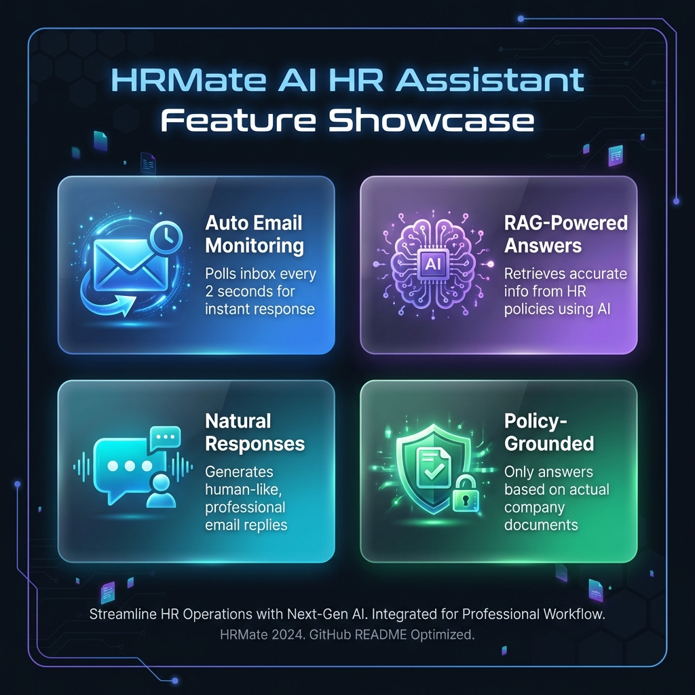
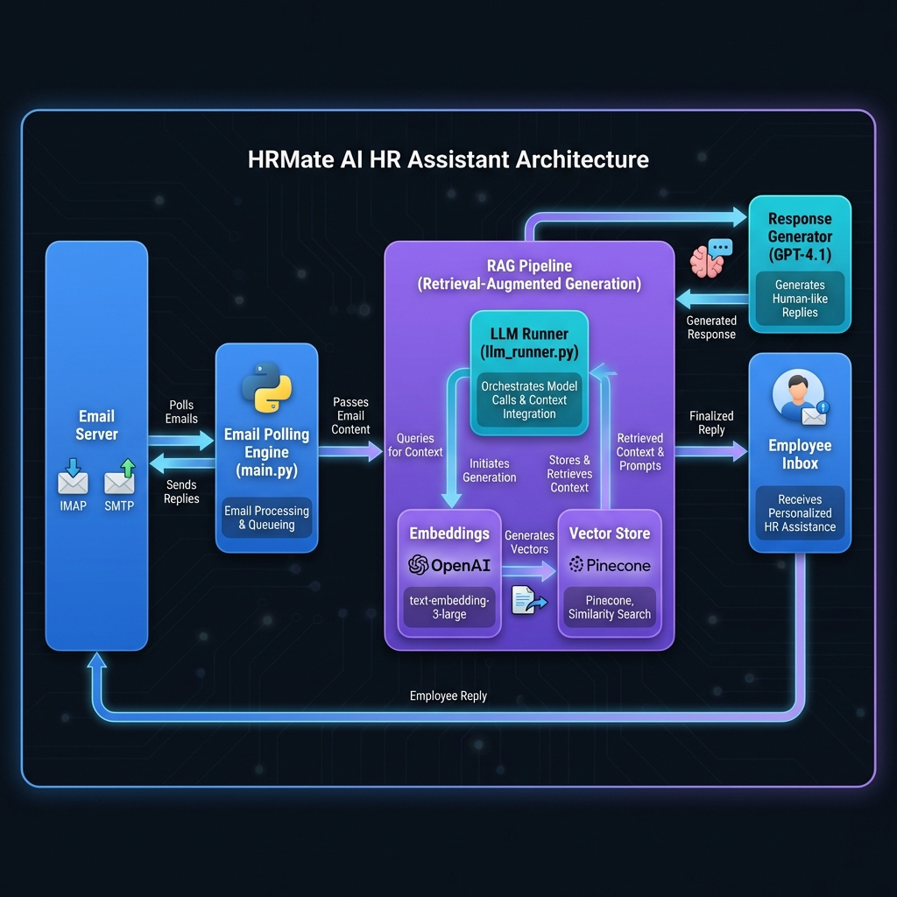

<p align="center">
  
</p>

<h1 align="center">🤖 HRMate</h1>

<p align="center">
  <strong>AI-Powered HR Assistant with RAG & Email Automation</strong>
</p>

<p align="center">
  
  
  
  
</p>

<p align="center">
  <a href="#-features">Features</a> •
  <a href="#-architecture">Architecture</a> •
  <a href="#-pipeline">Pipeline</a> •
  <a href="#-installation">Installation</a> •
  <a href="#-usage">Usage</a> •
  <a href="#-tech-stack">Tech Stack</a>
</p>

---

## 📖 Overview

**HRMate** is an intelligent, automated HR assistant that answers employee questions via email using cutting-edge AI technology. It combines **Retrieval-Augmented Generation (RAG)** with email automation to provide accurate, policy-grounded responses.

> 💡 **Think of it as:** A smart email bot that knows all your company's HR policies and responds to employee queries automatically — like having a 24/7 HR assistant!

---

## ✨ Features

<p align="center">
  
</p>

| Feature | Description |
|---------|-------------|
| 📧 **Auto Email Monitoring** | Polls inbox every 2 seconds for instant response |
| 🧠 **RAG-Powered Answers** | Retrieves accurate info from HR policies using AI |
| 💬 **Natural Responses** | Generates human-like, professional email replies |
| 🛡️ **Policy-Grounded** | Only answers based on actual company documents |
| 🔄 **Continuous Operation** | Runs 24/7 without manual intervention |
| ⚡ **Fast Response Time** | Near-instant automated replies |

---

## 🏗️ Architecture

<p align="center">
  
</p>

### Component Breakdown

| Component | File | Description |
|-----------|------|-------------|
| **Email Engine** | `main.py` | IMAP/SMTP email polling and reply sending |
| **LLM Runner** | `llm_runner.py` | Bridge between email handler and RAG system |
| **Chunker** | `rag/chunker.py` | Splits documents into searchable chunks |
| **Embeddings** | `rag/embbeding.py` | Converts text to vectors using OpenAI |
| **Vector Store** | `rag/vectorstore.py` | Manages Pinecone vector database |
| **LLM** | `rag/llm.py` | Generates responses using GPT-4.1 |

---

## 🔄 Pipeline

<p align="center">
  
</p>

### Phase 1: Setup (One-Time)

```
📄 HR Policy Document → 📦 Chunker (1000 chars) → 🧮 OpenAI Embeddings → 🗄️ Pinecone DB
```

### Phase 2: Runtime (Continuous)

```
📨 Incoming Email
    ↓
📋 Extract Query
    ↓
🔢 Generate Query Vector (OpenAI)
    ↓
🔍 Semantic Search (Pinecone)
    ↓
📝 Build Prompt (Query + Context)
    ↓
🤖 GPT-4.1 Response
    ↓
📤 Send Email Reply
```

---

## 🛠️ Tech Stack

### Core Technologies

| Technology | Purpose | Version |
|------------|---------|---------|
| 🐍 **Python** | Main programming language | 3.x |
| 🤖 **OpenAI API** | Embeddings & Text Generation | Latest |
| 🌲 **Pinecone** | Vector Database | 7.3.0 |
| 📧 **IMAP/SMTP** | Email Protocol | Standard |

### AI Models

| Model | Provider | Dimensions | Purpose |
|-------|----------|------------|---------|
| `text-embedding-3-large` | OpenAI | 3072 | Text vectorization |
| `gpt-4.1` | OpenAI | - | Response generation |

### Key Libraries

```
openai==1.107.3        # OpenAI API client
pinecone==7.3.0        # Vector database
python-dotenv==1.1.1   # Environment management
```

---

## 📦 Installation

### Prerequisites

- Python 3.x
- OpenAI API account
- Pinecone account
- Email account with IMAP/SMTP access

### Steps

1️⃣ **Clone the repository**
```bash
git clone https://github.com/yourusername/HRMate.git
cd HRMate
```

2️⃣ **Install dependencies**
```bash
pip install -r requirements.txt
```

3️⃣ **Configure environment variables**

Create a `.env` file in the root directory:
```env
# Email Configuration
EMAIL_USER=hrbot@yourcompany.com
EMAIL_PASS=your-app-specific-password
IMAP_SERVER=imap.gmail.com
SMTP_SERVER=smtp.gmail.com

# API Keys
OPENAI_API_KEY=sk-your-openai-api-key
PINECONE_API_KEY=pcsk-your-pinecone-key
PINECONE_INDEX_HOST=https://your-index.pinecone.io
```

4️⃣ **Set up the knowledge base** (One-time)
```bash
python rag_runner.py
```

---

## 🚀 Usage

### Start the Email Bot

```bash
python main.py
```

The bot will:
- ✅ Connect to your email server
- ✅ Poll for new emails every 2 seconds
- ✅ Process incoming HR queries
- ✅ Send AI-generated responses

### Stop the Bot

Press `Ctrl+C` to stop.

---

## 📁 Project Structure

```
HRMate/
├── 📄 main.py              # Email polling bot (entry point)
├── 📄 llm_runner.py        # RAG system bridge
├── 📄 rag_runner.py        # Knowledge base setup
├── 📄 requirements.txt     # Python dependencies
├── 📄 README.md            # This file
│
├── 📁 rag/                 # RAG module
│   ├── 📄 chunker.py       # Document splitter
│   ├── 📄 embbeding.py     # Vector embeddings
│   ├── 📄 llm.py           # GPT-4.1 integration
│   ├── 📄 vectorstore.py   # Pinecone operations
│   │
│   └── 📁 doc/
│       ├── 📄 policy.txt       # HR policy document
│       └── 📄 system_prompt.md # AI behavior instructions
│
└── 📁 assets/              # README images
    ├── 🖼️ banner.png
    ├── 🖼️ architecture.png
    ├── 🖼️ pipeline.png
    └── 🖼️ features.png
```

---

## 🔧 Configuration

### Chunking Parameters

| Parameter | Value | Description |
|-----------|-------|-------------|
| `chunk_size` | 1000 | Characters per chunk |
| `chunk_overlap` | 200 | Overlap between chunks |

### Email Settings

| Setting | Default | Description |
|---------|---------|-------------|
| `SMTP_PORT` | 587 | Secure email port |
| `POLL_INTERVAL` | 2 sec | Inbox check frequency |

---

## 🤝 How RAG Works

**Retrieval-Augmented Generation (RAG)** combines:

1. **Retrieval**: Finding relevant information from the knowledge base
2. **Augmentation**: Adding context to the AI prompt
3. **Generation**: Creating accurate, grounded responses

### Why RAG?

| Without RAG | With RAG |
|-------------|----------|
| ❌ AI may hallucinate | ✅ Grounded in actual documents |
| ❌ Generic responses | ✅ Specific, accurate answers |
| ❌ No source verification | ✅ Traceable to policy docs |

---

## 📊 Example Use Case

**Employee Email:**
> "How many sick days do I get per year?"

**HRMate Response:**
> Hello,
> 
> Thank you for reaching out! According to our company policy, full-time employees accrue sick leave at a rate of X days per year...
> 
> Best regards,
> HR Department

---

## 📝 License

This project is licensed under the MIT License - see the [LICENSE](LICENSE) file for details.

---

## 🙏 Acknowledgments

- [OpenAI](https://openai.com) for GPT-4.1 and Embeddings API
- [Pinecone](https://pinecone.io) for Vector Database
- Python community for amazing libraries

## 👤 Author

**Ansh Singh**

---

<p align="center">
  <a href="#-hrmate">⬆️ Back to Top</a>
</p>